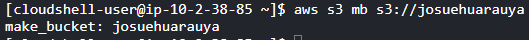
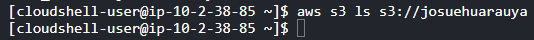

**Departamento Académico de Ingeniería C8280 -Comunicación de Datos y Redes**

Comunicación de Datos y Redes

**Indicaciones**

**Amazon S3 - AWS Elastic Block Store (EBS)**

1. Las respuestas deben ser explicadas, solo colocar resultados sin ninguna referencia no puntúa en las preguntas de la evaluación.
1. Realiza una copia de este documento y coloca todas tus respuestas y sube a tu repositorio personal de github en formato markdown. Presenta capturas de pantalla del procedimiento y las explicaciones necesarias. No puntúa si solo se hace la presentación de imágenes.
1. De preferencia adiciona un video adicional explicando los pasos realizados. Utiliza el sandbox de AWS usado en la práctica anterior.
1. Sube a la plataforma de Blackboard el enlace de github donde están todas tus respuestas. No olvides colocar tu nombre y apellido antes de subir el enlace de tus respuestas a la plataforma
1. Cualquier evidencia de copia elimina el examen se informará de la situación a la coordinación.

**Nombre:** Josue Eduardo Huarauya Fabian

**S3**

En este laboratorio, se estudiará el almacenamiento de Amazon S3. Utilizarás los comandos aws s3 y s3api para administrar datos en Amazon S3. Amazon S3 es un almacenamiento de objetos accesible a través de Internet.

# **Parte 1: Operaciones básicas con S3**

Suponga que su directorio actual es /home/aws\_user (puedes cambiarlo). Envíe las siguientes instrucciones y responde las preguntas que siguen.

1. Enumere todos los buckets propiedad del usuario a través del siguiente comando ls. aws s3 ls

**¿Cuál es la salida?**

La salida no muestra nada porque no hay buckets.

Este comando se utiliza para listar todos los buckets de Amazon S3 que son propiedad del usuario y para los que el usuario tiene permisos de lectura. La salida de este comando mostrará una lista de todos los buckets junto con la fecha de creación y la hora de cada uno. Cada línea de la salida incluirá la fecha y hora de la creación del bucket, seguida del nombre del bucket.

1. Haz un bucket a través del siguiente comando mb. aws s3 mb s3://tu\_nombre\_de\_usuario

**¿Cuál es la salida?**

Esto indica que se ha creado con éxito un nuevo bucket llamado josuehuarauya

1. Enumera el contenido del bucket a través del siguiente comando ls.

aws s3 ls s3://tu\_nombre\_de\_usuario

**¿Cuál es la salida?**

El comando no muestra ninguna salida porque el bucket está vacío.

1. Crea un directorio llamado páginas web (mkdir webpages) y cd en ese directorio. Crea un archivo html simple llamado hello.html con el siguiente contenido.

<html><body>

<h1>Amazon S3</h1> Hello World!

</body></html>

Carga el archivo en tu bucket s3 y póngalo a disposición del público con lo siguiente. aws s3 cp hello.html s3://tu\_nombre\_de\_usuario --acl public-read

**¿Cuál es la salida?**

La salida de este último comando normalmente confirmará que el archivo "hello.html" se ha copiado al bucket.

1. Dado que se puede acceder a tu objeto s3 a través de Internet, probémoslo. En el navegador web de tu máquina virtual (u otra9 accede a la URL[ http://s3.amazonaws.com/tu_nombre_de_usuario/hello.html.](http://s3.amazonaws.com/tu_nombre_de_usuario/hello.html) **¿Qué viste en el navegador?**

` `**Ví** “Hello World!” al visitar la URL, esto significa que el archivo se subió **correctamente,** al bucket de Amazon S3 y está accesible al **público**.
# **Parte 2: alojamiento de sitios web estáticos con S3**
1. Podemos usar el bucket como almacenamiento de sitios web estáticos. Experimentamos con eso aquí. Crea dos archivos html en el directorio actual llamados index.html y error.html. El contenido de los dos archivos se muestra a continuación.

<html><body>

This is an index page!

</body></html>

<html><body>

Sorry, we can't find that page!

</body></html>

El comando sync compara el directorio de origen con tu bucket S3 y carga solo archivos nuevos o modificados. Entonces puedes cargar ambos archivos fácilmente a través del siguiente comando.

aws s3 sync ./ s3://tu\_nombre\_de\_usuario/ --acl public-read

**¿Cuál es la salida?**

La salida de este comando muestra una lista de archivos que se han subido al bucket de S3.

` `Ahora habilitamos el bucket para alojamiento de sitios web estáticos con las siguientes instrucciones.

aws s3 website s3://tu\_nombre\_de\_usuario/

--index-document index.html

--error-document error.html

Observa cómo la instrucción enlaza ambos archivos con sus usos. En el navegador web de tu VM, acceda a la URL

http://tu\_nombre\_de\_usuario.s3-website-us-east-1.amazonaws.com/

**¿Qué viste en el navegador? ¿Por qué?**

**¿Qué viste en el navegador?** Vi “This is an index page!”, significa que estoy viendo el contenido del archivo index.html que** subí al bucket de S3. **¿Por qué?** Cuando configuré el bucket de S3 para alojar un sitio web estático y establecí un documento de índice, Amazon S3 devuelve el documento de índice (en este caso, index.html) siempre que se solicita la URL base del bucket. Por lo tanto, cuando visite http://tu\_nombre\_de\_usuario.s3-website-us-east-1.amazonaws.com/, veo el contenido de index.html porque es el documento de índice que configuré para el sitio web.

Ahora, acceda a http://tu\_nombre\_de\_usuario.s3-website-us-east 1.amazonaws.com/ hello.html

**¿Qué viste en el navegador?** 

¿Qué viste en el navegador? **V**i “Amazon S3” y “Hello World!”, significa que estoy viendo el contenido del archivo hello.html que **subí** al bucket de S3.

A continuación, acceda a

http://tu\_nombre\_de\_usuario.s3-website-us-east-1.amazonaws.com/2.html.

` `**¿Qué viste en el navegador?** Vi "Sorry, we can't find that page!", que es el contenido del archivo error.html que subí a mi bucket de S3. **¿Por qué?** Esto es porque intenté acceder a un archivo (2.html) que no existe en mi bucket de S3. Cuando esto sucede, Amazon S3 devuelve el documento de error que configuré para mi sitio web, que en este caso es error.html.

1. Podemos definir reglas de redirección y agregar metadatos a los objetos en el bucket. Ejecuta el siguiente comando para hacerlo. Observa que este comando usa s3api, no s3.

aws s3api put-object --bucket *tu\_nombre\_de\_usuario*

--key hello.html

--website-redirect-location [http://www.nku.edu/~haow1 ](http://www.nku.edu/~haow1)--acl public-read

--metadata redirection\_creator=aws\_user

Ahora http://*tu\_nombre\_de\_usuario*.s3-website-us-east-1.amazonaws.com/hello.html

**¿Qué viste en el navegador?** Vi la información de Wei Hao, Ph.D., el director del programa MSCS y MSCIT en la Universidad del Norte de Kentucky. Esto incluye sus intereses de investigación, publicaciones y subvenciones, experiencia en la industria, actividades profesionales, y premios y honores.

**¿Por qué?** Esto es porque intenté acceder al archivo **hello.html** en mi bucket de S3, pero configuré una regla de redirección para ese archivo para redirigir a los visitantes a **http://www.nku.edu/~haow1**. Por lo tanto, en lugar de ver el contenido de **hello.html**, fui redirigido a la página web de Wei Hao en la Universidad del Norte de Kentucky.

1. Para recuperar los metadatos de un objeto, usamos el subcomando head-object. Emite la siguiente instrucción.

aws s3api head-object --bucket tu\_nombre\_de\_usuario --key hello.html

**¿Cuál es la salida?**

# 
#
# La salida incluye varios metadatos sobre el objeto `hello.html`:
#
# - **`AcceptRanges`**: "bytes" indica que el objeto soporta solicitudes de rango de bytes.
# - **`LastModified`**: "2023-06-15T07:54:04+00:00" es la fecha y hora en que el objeto fue modificado por última vez.
# - **`ContentLength`**: 0 significa que el objeto no tiene contenido, lo que tiene sentido porque se trata de una redirección.
# - **`ETag`**: "\"d41d8cd98f00b204e9800998ecf8427e\"" es una entidad de etiqueta única para esta versión del objeto.
# - **`ContentType`**: "binary/octet-stream" es el tipo de contenido del objeto.
# - **`WebsiteRedirectLocation`**: **"http://www.nku.edu/~haow1"** es la URL a la que se redirigirán los visitantes que intenten acceder a este objeto.
# - **`ServerSideEncryption`**: "AES256" indica que el objeto se almacena en S3 con encriptación del lado del servidor.
# - **`Metadata`**: {"redirection\_creator": "aws\_user"} muestra que se ha añadido un metadato personalizado al objeto, especificando que el creador de la redirección es "aws\_user".
#
# Esta salida confirma que el objeto **`hello.html`** se ha configurado correctamente para redirigir a los visitantes **a "http://www.nku.edu/~haow1"**, y que se ha añadido el metadato personalizado "redirection\_creator" con el valor "aws\_user".
#
# **Parte 3: Limpieza**

1. Podemos eliminar objetos usando rm. Elimina tu página de índice de la siguiente manera.

aws s3 rm s3://tu\_nombre\_de\_usuario/index.html

**¿Cuál es la salida?**

La salida del comando es **`delete: s3://josuehuarauya/index.html`**. Esto indica que el archivo **`index.html`** ha sido eliminado con éxito de mi bucket de S3 **`josuehuarauya`**. Por lo tanto, ya no debería poder acceder a este archivo en mi bucket.

1. Y podemos quitar el bucket como un todo. Usa lo siguiente. aws s3 rb s3://tu\_nombre\_de\_usuario --force

**¿Cuál es la salida? ¿Qué hace --force?**

**¿Cuál es la salida?** La salida del comando muestra que todos los archivos en el bucket **`josuehuarauya`** han sido eliminados. Los archivos eliminados incluyen **`.bash\_profile`, `.zshrc`, `.bash\_logout`, `.config/powershell/Microsoft.PowerShell\_profile.ps1`, `.bashrc`, `error.html`**, y **`hello.html`**. Después de eliminar todos los archivos, el bucket **`josuehuarauya`** también se ha eliminado, como se indica en la última línea: **`remove\_bucket: josuehuarauya`**.

**¿Qué hace --force?** La opción **`--force`** en el comando **`aws s3 rb`** fuerza la eliminación del bucket incluso si no está vacío. Sin esta opción, AWS S3 no permitiría eliminar un bucket que todavía contiene archivos. Así que al usar **`--force`**, le estamos diciendo a AWS S3 que primero elimine todos los archivos en el bucket y luego elimine el bucket en sí.

EBS

En este laboratorio, se utilizará la CLI de AWS para crear un volumen y una instantánea de Amazon EBS y configurar tu almacenamiento de EBS como un arreglo RAID.

# **Parte 1. Crea un nuevo volumen de EBS**

1. Inicia sesión en el sandbox del curso. Crea un nuevo volumen de EBS con el siguiente comando.

aws ec2 create-volume --size 1 --region us-east-1

--availability-zone us-east-1c

**¿Qué significa este comando? ¿Cuál es la salida?**

**¿Qué significa este comando?** El comando **`aws ec2 create-volume --size 1 --region us-east-1 --availability-zone us-east-1c`** se utiliza para crear un nuevo volumen de Amazon Elastic Block Store (EBS) de 1 GB en la zona de disponibilidad **`us-east-1c`** de la región **`us-east-1`**.

**¿Cuál es la salida?** La salida del comando es un objeto JSON que contiene información sobre el volumen de EBS recién creado:

\- **`AvailabilityZone`**: **`us-east-1c`**. Esta es la zona de disponibilidad en la que se creó el volumen.

\- **`CreateTime`**: **`2023-06-15T16:18:12+00:00`**. Esta es la fecha y hora en la que se creó el volumen.

\- **`Encrypted`**: **`false`**. Esto indica que el volumen no está cifrado.

\- **`Size`**: **`1`**. Este es el tamaño del volumen en gigabytes.

\- **`SnapshotId`**: `**""**`. Como este volumen se creó desde cero y no a partir de una instantánea, el ID de la instantánea está vacío.

\- **`State`**: **`creating`**. Esto indica que el volumen está en proceso de creación.

\- **`VolumeId`**: **`vol-0a18181eeda8607e3`**. Este es el ID único del volumen.

\- **`Iops`**: **`100`**. Esto indica el número de operaciones de entrada/salida por segundo que el volumen admite.

\- **`Tags`**: **`[]`**. Como no se especificaron etiquetas al crear el volumen, este campo está vacío.

\- **`VolumeType`**: **`gp2`**. Este es el tipo de volumen de EBS, en este caso, un volumen de propósito general (gp2).

\- **`MultiAttachEnabled`**: **`false`**. Esto indica que no se puede conectar el volumen a varias instancias EC2 al mismo tiempo.

Por lo tanto, la salida confirma que se ha creado un nuevo volumen de EBS de 1 GB en la zona de disponibilidad **`us-east-1c`**. El volumen está en proceso de creación y su ID es **`vol-0a18181eeda8607e3`**.

1. Utiliza el siguiente comando para ver la información de tu volumen de EBS donde se te proporcionó volume\_id en el resultado del comando anterior.

aws ec2 describe-volume-status --volume-ids volume\_id

**¿Cuál es la salida?**

La salida del comando **`aws ec2 describe-volume-status`** proporciona información detallada sobre el estado del volumen de EBS especificado. En este caso, el volumen **`vol-0a18181eeda8607e3`** se encuentra en la zona de disponibilidad **`us-east-1c`**. No hay eventos o acciones registrados para este volumen en este momento.

El estado del volumen se indica como `ok`, lo que significa que el volumen está en buen estado. Los detalles del estado del volumen también muestran que las operaciones de entrada/salida (I/O) están habilitadas (`io-enabled: passed`) para este volumen. El estado `io-performance: not-applicable` significa que la métrica de rendimiento de I/O no es aplicable para este volumen, probablemente debido a su tipo o a su patrón de uso.

1. Para crear una instancia de EBS, hazlo siguiente.

aws ec2 run-instances --image-id ami-d9a98cb0 --count 1

–instance-type t1.micro –key-name

tu\_nombre\_de\_usuario-key --security-groups tu\_nombre\_de\_usuario

--placement AvailabilityZone=us-east-1c

Ahora, adjunta el volumen de EBS a la instancia. Esto lo colocas en el directorio

/dev/sdf en tu instancia EC2.

aws ec2 attach-volume --volume-id volume\_id --instance-id 

id\_instance --device /dev/sdf

**¿Cuál es la salida?**

La salida del comando **`aws ec2 attach-volume`** indica que el volumen con ID **`vol-0a18181eeda8607e3`** está siendo adjuntado a la instancia con ID **`** **i-0c8eac823e741cc81`** en el dispositivo **`/dev/sdf`**. La hora de adjuntamiento y el estado de "attaching" sugieren que el proceso de adjuntamiento está en progreso. Una vez que el proceso se complete con éxito, el estado cambiará a "attached".

1. Inicia sesión en la instancia EC2 a través de ssh. En tu instancia EC2, cambie a root. Ahora queremos crear un sistema de archivos en el volumen de EBS (el volumen de EBS es básicamente un dispositivo de almacenamiento en blanco). Luego necesitamos montar el volumen para que sea accesible. Utiliza los siguientes comandos desde tu EC2. Ten en cuenta que, según el controlador del dispositivo de bloque del kernel, el dispositivo puede estar conectado con un nombre diferente al que ha especificado. Por ejemplo, si especificas un nombre de dispositivo de

/dev/sdf, el kernel podría cambiar el nombre de tu dispositivo a /dev/xvdf, en la mayoría de los casos, la letra final sigue siendo la misma. Ejecuta lsblk en tu terminal para ver tus dispositivos de disco disponibles y tus puntos de montaje (si corresponde) para ayudarte a determinar el nombre de dispositivo correcto que debe usar. Suponga que el kernel cambia el nombre del dispositivo a /dev/xvdf.

Ahora se ve que ya está conectado a la instancia EC2 a través de SSH. Ahora ya puedo ejecutar los comandos en la instancia EC2.

El resultado de **lsblk** muestra que tiengo un disco **xvdf** de 1 GB, que parece ser el volumen de EBS.

mkfs -F /dev/xvdf

`          `**¿Cuál es la salida?**

Esto indica que se ha creado con éxito un sistema de archivos en el volumen de EBS **‘/dev/xvdf’**.

mkdir /data

mount /dev/xvdf /data cd /data/

df

**¿Cuál es la salida?**

La salida muestra que el volumen **`/dev/xvdf`** se ha montado correctamente en la ruta **`/data`** en el sistema de archivos. Ahora tiene aproximadamente 1GB de espacio, con solo una pequeña cantidad usada (1%). Ahora puedes usar el directorio **`/data`** para almacenar archivos y deberían escribirse en el volumen de 1GB que acabas de montar.

# **Parte 2. Instantáneas de EBS**

1. Crea un archivo llamado aws\_user.txt y escribe lo que desees en el archivo. Ahora, veremos cómo crear una copia de seguridad de todo tu volumen de EBS. El primer paso es asegurarte de que todos los datos en memoria se hayan escrito en el volumen (disco), ya que es posible que el archivo creado aún no se haya guardado en el disco. Para forzar que esto suceda, usamos el comando sync (sincronización). En la ventana de tu terminal para su instancia EC2, ejecuta las siguientes instrucciones.

root@ip-10-45-185-154:/data# sync

Se ha creado con éxito el archivo "aws\_user.txt" en el volumen de EBS y he confirmado que los datos se han escrito en el disco.

Abre una segunda ventana de terminal en tu máquina virtual. Emite el siguiente comando.

aws ec2 create-snapshot --volume-id volume\_id

--description "Esta es mi instantánea de volumen".

donde volume\_id es el id obtenido del paso 1. **¿Cuál es el resultado?**  El comando **"aws ec2 create-snapshot --volume-id vol-0a18181eeda8607e3 --description "Esta es mi instantanea de volumen""** fue ejecutado correctamente. Como resultado, se creó un snapshot con la descripción **"Esta es mi instantanea de volumen"** para el volumen con ID **"vol-0a18181eeda8607e3"**

Por favor, tenga en cuenta que el estado de la instantánea es "pendiente", lo que significa que la instantánea se está creando actualmente. Puede llevar algún tiempo completar este proceso.

Puedes verificar el estado de tu instantánea usando las siguientes instrucciones.

aws ec2 describe-snapshots --snapshot-id snapshot\_id

El snapshot\_id debe ser parte de la salida de la instrucción de creación de instantáneas que acaba de ejecutar. **¿Cuál es el resultado del comando**

**describe-snapshot? **

El comando **`aws ec2 describe-snapshots --snapshot-id snap-0b21c4108e300c4ce`** devuelve una descripción de la instantánea que acabo de crear. Según la salida, la instantánea se ha completado con éxito. La descripción de la instantánea coincide con lo que establecí durante la creación ("Esta es mi instantanea de volumen"), y la "Progresión" está al 100%, lo que indica que la instantánea se ha completado. Además, el "Estado" de la instantánea es "completado", lo que también confirma que la instantánea se ha creado con éxito. Por lo tanto, hemos logrado realizar una copia de seguridad de nuestro volumen de EBS.

Continúa repitiendo este comando hasta que vea que el estado de la instantánea cambia a "completado", lo que significa que se ha realizado una copia de seguridad del volumen.

1. Dada una instantánea, podemos usarla para crear un nuevo volumen. Ejecuta el siguiente comando. Utiliza el ID de instantánea del paso 5.

aws ec2 create-volume --región us-east-1

--availability-zone us-east-1c

--snapshot-id snapshot\_id

**¿Cuál es la salida?** 

El comando **`aws ec2 create-volume`** se ejecutó correctamente y ha creado un nuevo volumen a partir de la instantánea. 

Esto indica que se ha creado un nuevo volumen (**`vol-0af38f78dd14a0b32`**) basado en la instantánea (**`snap-0b21c4108e300c4ce`**). El estado del volumen es "creating", lo que significa que todavía se está creando. Por favor, espera unos momentos mientras el volumen se completa.

Comprueba el estado del volumen**. ¿Qué comando ejecutaste para verificar el estado?** 

`       `**aws ec2 describe-volumes --volume-id vol-0af38f78dd14a0b32**

**¿Cuál es la salida?**

El comando **`aws ec2 describe-volumes`** se ejecutó exitosamente y proporcionó información sobre el estado del volumen **`vol-0af38f78dd14a0b32`**. 

Esto indica que el volumen **`vol-0af38f78dd14a0b32`** se ha creado correctamente y está disponible para su uso. El estado del volumen es "available", lo que significa que está listo para ser adjuntado a una instancia o utilizado según sea necesario.

1. Repite el comando de adjuntar volumen del paso 3 para adjuntar este nuevo volumen. El ID de volumen será el que se devolvió al obtener el estado 6, mientras que el ID de instancia es el de tu instancia EC2 que obtuvo en el paso 3.

aws ec2 attach-volumen --volume-id volume\_id

--instance-id instance\_id --device /dev/sdg

**¿Cuál es la salida?**

El comando **`aws ec2 attach-volume`** se ejecutó correctamente.

Esto indica que el volumen **`vol-0af38f78dd14a0b32`** se ha adjuntado a la instancia **`i-0c8eac823e741cc81`** en el dispositivo **`/dev/sdg`**. El estado del volumen es "attaching", lo que significa que el proceso de adjuntar el volumen a la instancia está en curso.

Para verificar el estado de la operación de adjuntar el volumen.

El comando **`aws ec2 describe-volumes`** se ejecutó correctamente y proporcionó información sobre el estado del volumen **`vol-0af38f78dd14a0b32`**. 

Esto indica que el volumen **`vol-0af38f78dd14a0b32`** se encuentra en uso y está adjuntado a la instancia **`i-0c8eac823e741cc81`** en el dispositivo **`/dev/sdg`**. El estado del volumen es "in-use" y el estado de la adjunción es "attached".

1. Vuelve a la ventana de la terminal en la que se tiene ssh en tu instancia EC2. Desde ese terminal, crea un punto de montaje llamado /data2 y monte el nuevo volumen allí. 

**¿Qué comandos se ejecutó para lograr ambas tareas?** 

1. Crear el punto de montaje:

**mkdir /data2**

1. Montar el volumen en el punto de montaje:

**mount /dev/xvdf /data2**

**Cambia el directorio de su instancia EC2 a /data2. ¿Viste el archivo aws\_user.txt?**

1. Cambiar al directorio /data2:

**cd /data2**

1. Para verificar si el archivo aws\_user.txt está presente en el directorio /data2.

**ls**

En el directorio /data2, se muestra el archivo aws\_user.txt junto con el directorio lost+found cuando ejecutaste el comando **‘ls’**.

1. Ahora queremos desmontar nuestros volúmenes, para lo cual usamos el comando umount. Luego separaremos los volúmenes de la instancia EC2 y los destruiremos. Los siguientes son los comandos a ejecutar. Ten en cuenta que los primeros tres comandos están en su instancia EC2 y el resto está en tu VM.

root@ip-10-45-185-154:/data3# cd /

root@ip-10-45-185-154:/# unmount /dev/xvdf root@ip-10-45-185-154:/# unmount /dev/xvdg

Ahora desconecta y elimina el primer volumen, cuyo volume\_id obtuvo en el paso 1. Espera unos 10 segundos después de desconectar antes de intentar eliminar.

aws ec2 detach-volume --volume-id volume\_id aws ec2 delete-volume --volume-id volume\_id

**¿Cuáles son las salidas?** 

Se ha desconectado y eliminado el primer volumen correctamente. 

**-** La salida del comando **`aws ec2 detach-volume`** indica que el volumen con ID **`vol-0a18181eeda8607e3`** se ha desconectado con éxito. El estado del volumen cambió a "detaching" y se proporcionan detalles como el tiempo de conexión (**`AttachTime`**), el dispositivo (**`Device`**), la ID de instancia (**`InstanceId`**) y el estado actual del volumen (**`State`**).

**-** La salida del comando **`aws ec2 delete-volume`** no devuelve ninguna respuesta. Esto indica que el volumen con ID **`vol-0a18181eeda8607e3`** se ha eliminado sin errores. 

Repite estos dos comandos para el segundo volumen, cuyo volume\_id deberías haber obtenido del paso 6.

**¿Qué comandos usastes?**

1. Desconectar el volumen:

**aws ec2 detach-volume --volume-id vol-0af38f78dd14a0b32**

1. Desconectar el volumen:

**aws ec2 delete-volume --volume-id vol-0af38f78dd14a0b32**

**¿Cuáles son las salidas?**

Se ha desconectado y eliminado el segundo volumen correctamente.

\- La salida del comando **`aws ec2 detach-volume`** indica que el volumen con ID **`vol-0af38f78dd14a0b32`** se está desconectando con éxito. El estado del volumen cambió a "detaching" y se proporcionan detalles como el tiempo de conexión (**`AttachTime`**), el dispositivo (**`Device`**), la ID de instancia (`**InstanceId**`) y el estado actual del volumen (`**State**`).

\- La salida del comando **`aws ec2 delete-volume`** no devuelve ninguna respuesta. Esto indica que el volumen con ID **`vol-0af38f78dd14a0b32`** se ha eliminado sin errores.

1. Elimina la instantánea con lo siguiente usando su snapshot\_id del paso 5. aws ec2 delete-snapshot --snapshot-id *snapshot\_id.}*

Se ha eliminado correctamente la instantánea con ID **`snap-0b21c4108e300c4ce`**. La salida del comando **`aws ec2 delete-snapshot`** no devuelve ninguna respuesta, lo que indica que la instantánea se ha eliminado sin errores.

1. Cambie a la terminal. De lo que aprendiste en la parte 1, crea dos volúmenes de 1 GB en la zona de disponibilidad us-east-1c. 

**¿Qué comandos ejecutaste?** 

1. Primer comando:

**aws ec2 create-volume --size 1 --region us-east-1 --availability-zone us-east-1c**

1. Segundo comando:

**aws ec2 create-volume --size 1 --region us-east-1 --availability-zone us-east-1c**

**¿Cuáles son las salidas?** 

Al ejecutar el comando **‘aws ec2 create-volume --size 1 --region us-east-1 --availability-zone us-east-1c’**, se crearon dos volúmenes de 1 GB cada uno en la zona de disponibilidad us-east-1c.

Las salidas indican que se están creando los volúmenes. Cada salida contiene información sobre los volúmenes recién creados, incluyendo su ID, tamaño, zona de disponibilidad, estado, tipo de volumen, etc.

Adjunta ambos volúmenes a tu instancia EC2, haciendo que aparezcan como /dev/sdh1 y /dev/sdh2, respectivamente. 

**¿Qué comandos ejecutaste?**

1. Adjuntar el primer volumen (/dev/sdh1):

**aws ec2 attach-volume --volume-id vol-053ca01c82b1b86f1 --instance-id i-0c8eac823e741cc81 --device /dev/sdh1**

1. Adjuntar el primer volumen (/dev/sdh2):

**aws ec2 attach-volume --volume-id vol-07017bddc50dcd7c7 --instance-id i-0c8eac823e741cc81 --device /dev/sdh2**

` `**¿Cuáles son las salidas?**

Los volúmenes han sido adjuntados a tu instancia EC2 con los dispositivos **`/dev/sdh1`** y **`/dev/sdh2`**. Ambos están en el estado "attaching", lo que significa que el proceso de adjuntar los volúmenes está en curso. Ahora debemos esperar a que el estado cambie a "attached" para confirmar que los volúmenes se han adjuntado correctamente a tu instancia EC2.

1. Cambia al terminal de la instancia EC2. Usaremos el programa mdadm de Linux para configurar los volúmenes en una configuración RAID. Instala mdadm de la siguiente manera.

apt-get update

apt-get install mdadm

Escribe "y" y presiona enter cuando se te solicite, seleccione "No configuration" cuando se te solicite y presiona enter. Ahora ejecutamos mdadm para crear un arreglo RAID 0 en los dos volúmenes. 

Ejecuta lo siguiente. Donde vea "renamed\_/dev/sdh1" y "renamed\_/dev/shd2", usa los nombres que se te proporcionó AWS en el paso 11.

mdadm --create /dev/md0 --level 0 --metadata=1.1

--raid-devices 2 renamed\_/dev/sdh1 renamed\_/dev/sdh2

**¿Cuál es la salida?**

La salida del comando **`mdadm --create /dev/md0 --level 0 --metadata=1.1 --raid-devices 2 /dev/xvdh1 /dev/xvdh2`** indica que la creación del arreglo RAID 0 ha sido exitosa. El mensaje **`mdadm: array /dev/md0 started.`** significa que el arreglo RAID se ha iniciado y está listo para ser usado.

Por lo tanto, ahora tiengo un arreglo RAID 0 disponible en **`/dev/md0`** que consta de los dos discos **`/dev/xvdh1`** y **`/dev/xvdh2`**. 

Un RAID 0 combina ambos discos en uno solo, mejorando el rendimiento al permitir lecturas y escrituras más rápidas, ya que los datos se dividen entre los dos discos. Sin embargo, no proporciona redundancia, lo que significa que si uno de los discos falla, se perderán todos los datos en el RAID. Por lo tanto, es importante asegurarte de tener copias de seguridad adecuadas de cualquier dato importante almacenado en este RAID.

1. Ahora, podemos comprobar el estado de la matriz RAID 0. Emite lo siguiente. mdadm --detail /dev/md0

**¿Cuál es la salida?** 

La salida indica que la matriz RAID 0 fue creada correctamente. Los detalles importantes a notar son los siguientes:

\- **Raid Level**: raid0. Esto indica que el arreglo que se ha creado es una configuración RAID 0.

\- **Array Size**: 2096128 (2047.34 MiB 2146.44 MB). Este es el tamaño total de la matriz RAID, que es la suma de los tamaños de los dos volúmenes que la conforman.

\- **Raid Devices**: 2. El número de dispositivos en la matriz RAID es 2, que son los dos volúmenes que hemos agregado.

\- **Total Devices**: 2. El número total de dispositivos es 2, que coincide con el número de dispositivos en la matriz RAID.

\- **State**: clean. Esto indica que la matriz RAID está funcionando correctamente y no hay errores.

\- **Active Devices**: 2. Este es el número de dispositivos activos en la matriz RAID.

\- **Working Devices**: 2. Este es el número de dispositivos que están funcionando correctamente en la matriz RAID.

\- **Failed Devices**: 0. No hay dispositivos fallidos en la matriz RAID.

\- **Spare Devices**: 0. No hay dispositivos de repuesto en la matriz RAID.

\- **Chunk Size**: 512K. Este es el tamaño de los fragmentos que se utilizan en la matriz RAID.

\- En la parte inferior, se muestran los dos dispositivos que conforman la matriz RAID, /dev/xvdh1 y /dev/xvdh2, ambos en estado "active sync".

En resumen, la matriz RAID 0 ha sido configurada correctamente y todos los dispositivos están funcionando correctamente.

Tenemos que agregar un sistema de archivos al arreglo RAID 0. Entonces queremos montarlo. Haz lo siguiente.

La salida del comando **‘mkfs /dev/md0’** indica que se ha creado con éxito un sistema de archivos en el dispositivo RAID, **‘/dev/md0’**.

mkfs /dev/md0 

mkdir /data3

mount /dev/md0 /data3

Los comandos ejecutados, **`mkdir /data3`** y **`mount /dev/md0 /data3`**, hacen lo siguiente:

\- **`mkdir /data3`**: Este comando crea un nuevo directorio llamado `/data3` en el sistema de archivos. Este directorio actuará como el punto de montaje para el sistema de archivos RAID que acabamos de crear.

\- **`mount /dev/md0 /data3`**: Este comando monta el sistema de archivos RAID (`/dev/md0`) en el directorio `/data3` que acabamos de crear. Esto significa que ahora el sistema de archivos RAID es accesible a través de la ruta `/data3` y cualquier dato que se escriba en `/data3` se almacenará en el RAID.

Así que ahora, nuestro RAID 0 está montado en el sistema de archivos en la ubicación `/data3` y está listo para ser usado.

El comando df de Linux muestra información sobre los sistemas de archivos montados. 

**¿Cuál es la salida?**

La salida del comando `df` muestra el uso del espacio en disco de los sistemas de archivos en su sistema.

\- **`/dev/xvda1`**: Este es el sistema de archivos raíz, con un total de aproximadamente 8.3 GB de espacio, de los cuales aproximadamente 1 GB está en uso, lo que representa el 14% del total. Tiene alrededor de 6.8 GB de espacio disponible.

\- **`udev`**: Este es el sistema de archivos para /dev, con un total de alrededor de 265 MB de espacio, de los cuales casi ninguno está en uso.

\- **`tmpfs`** (para /run): Este es un sistema de archivos en memoria con alrededor de 109 MB de espacio total, de los cuales muy poco está en uso.

\- **`none`** (para /run/lock y /run/shm): Estos son sistemas de archivos en memoria con 5 MB y 273 MB de espacio total, respectivamente, ninguno de los cuales está en uso.

\- **`/dev/md0`**: Este es el sistema de archivos para nuestro RAID, montado en **`/data3`**. Tiene un total de alrededor de 2 GB de espacio, de los cuales muy poco está en uso (alrededor de 3 MB, o el 1% del total). Tiene alrededor de 1.9 GB de espacio disponible.

En resumen, hemos creado con éxito un sistema de archivos RAID 0, lo hemos montado en `/data3` y ahora está listo para ser utilizado con alrededor de 1.9 GB de espacio disponible.

1. Finalizamos este laboratorio deteniendo el arreglo RAID 0, separando y eliminando ambos volúmenes de EBS y luego finalizando la instancia EC2. Para detener el arreglo RAID 0, haz lo siguiente desde su instancia EC2.

cd /

unmount /dev/md0 mdadm --stop /dev/md0

He desmontado el sistema de archivos montado en el dispositivo RAID, **`/dev/md0`**, utilizando el comando **`umount`**. Luego he detenido el arreglo RAID 0 utilizando el comando **`mdadm --stop /dev/md0`**. La salida **`mdadm: stopped /dev/md0`** confirma que el arreglo RAID 0 se ha detenido correctamente.

Ahora, cambia a tu terminal. Separa y elimina ambos volúmenes de EBS. **¿Qué comandos ejecutaste?** 

1. Para separar los volúmenes de la instancia EC2, use el comando**`detach-volume`** del AWS CLI:

**aws ec2 detach-volume --volume-id vol-053ca01c82b1b86f1**

**aws ec2 detach-volume --volume-id vol-07017bddc50dcd7c7**

1. Para eliminar los volúmenes, use el comando **`delete-volume`** del AWS CLI:

**aws ec2 delete-volume --volume-id vol-053ca01c82b1b86f1**

**aws ec2 delete-volume --volume-id vol-07017bddc50dcd7c7**

**¿Cuáles son las salidas?** 

En primer lugar, he separado los dos volúmenes de EBS de la instancia EC2 utilizando el comando **`aws ec2 detach-volume`**.

El primer volumen con ID **`vol-053ca01c82b1b86f1`** fue separado exitosamente. El sistema me devolvió información relevante de la operación, como la hora exacta de la separación (**`2023-06-19T03:46:23+00:00`**), el ID de la instancia **(`i-0c8eac823e741cc81`**), el estado actual de la operación (**`detaching`**), y el dispositivo del cual se separó el volumen (**`/dev/sdh1`**).

La operación se repitió con éxito para el segundo volumen con ID **`vol-07017bddc50dcd7c7`**, obteniendo información similar a la del primer volumen.

Después de separar los volúmenes, procedí a eliminarlos utilizando el comando **`aws ec2 delete-volume`**. En este caso, la ejecución exitosa de estos comandos no produjo ninguna salida, lo cual es esperado según la documentación de AWS. Por lo tanto, puedo inferir que los volúmenes **`vol-053ca01c82b1b86f1`** y **`vol-07017bddc50dcd7c7`** se eliminaron correctamente.

Finaliza tu instancia EC2. 

**¿Qué comando ejecutaste?** 

El comando para terminar una instancia de EC2 es el siguiente:

**aws ec2 terminate-instances --instance-ids i-0c8eac823e741cc81**

**¿Cuál es la salida?**

La salida del comando **`aws ec2 terminate-instances`** indica que la instancia de EC2 con ID **`i-0c8eac823e741cc81`** ha sido programada para terminar.

El resultado muestra que la instancia actualmente se encuentra en el estado "shutting-down" (código 32) y que anteriormente estaba en el estado "running" (código 16). Esto significa que la instancia se encuentra en proceso de apagado y pasará al estado "terminated" una vez finalizado el proceso de terminación.

Por lo tanto, la instancia de EC2 está siendo terminada correctamente.

Para verificar si la instancia de EC2 ha terminado, use le comando **‘describe-instances**’ de la CLI de AWS.

**aws ec2 describe-instances --instance-ids i-0c8eac823e741cc81**

 La instancia ha finalizado su ejecución y se encuentra en el estado "terminated" (código 48). Esto indica que la instancia ha sido completamente terminada y ya no está disponible.
